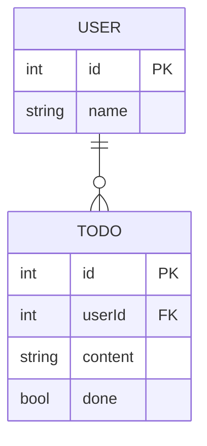

# ER Diagram

```mermaid

erDiagram
    USER {
        int id PK
        string name
    }

    TODO {
        int id PK
        int userId FK
        string content
        bool done
    }

    USER ||--O{ TODO : ""
```
